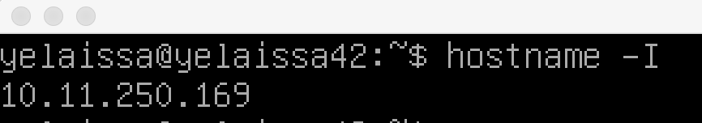
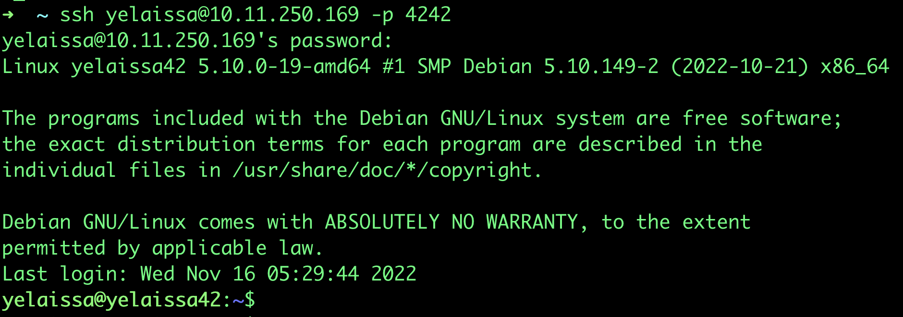

# Mandatory

## ```Partitions```
<br/>

> Comming soon

source ~ https://www.redhat.com/sysadmin/lvm-vs-partitioning

---
<br/>

## ```Server configuration```
<br/>

>  login to the root account
```console
$ su
```
> and install the sudo package (sudo gives limited users root privileges)
```console
 $ apt install sudo
```
> Adds the specified user to the sudo group
```console
 $ adduser yelaissa sudo
```
> Check if the user is added to sudo group
```console
$ getent group sudo
```
```C
Reboot the system with the "reboot" command.
```
source ~ https://wiki.debian.org/sudo/https://wiki.debian.org/sudo/

source ~ https://www.cloudpanel.io/tutorial/how-to-add-user-to-sudoers-in-debian/
(add user to sudoers)

---
<br/>

> Update the package lists.
```console
$ sudo apt update
```
> Open sudo files with "visudo"

> Creates a more secure structure, we created a new file called 1337 in the specified directory
```console
$ sudo visudo -f /etc/sudoers.d/1337
```
> And we will add the following codes.

```c
// The maximum number of password attempts with Sudo is 3 (3 is the standard)

Defaults passwd_tries=3

// Your error message after incorrect password attempts

Defaults badpass_message="incorrect password"

// Stores all used sudo commands in the specified file

Defaults logfile="/var/log/sudo/1337"

// Used to keep logs of input and output events.

Defaults log_input,log_output

// Archive log_input and log_output events to the specified directory.

Defaults iolog_dir="/var/log/sudo"

// Enforces TTY mode.

Defaults requiretty

// To restrict the directories used by Sudo.

Defaults secure_path="see subject"

```
```C
Reboot the system with the "reboot" command.
```
source ~ https://www.tecmint.com/sudoers-configurations-for-setting-sudo-in-linux/

source ~ https://manpages.debian.org/bullseye/sudo-ldap/sudoers.5.en.html#Tag_Spec

---
<br/>

> Openssh provides a secure channel over an unsecured network from outside
>> let install the Openssh-server package
```console
$ sudo apt install openssh-server
```
> SSH Configuration section.
```console
$ sudo nano /etc/ssh/sshd_config
```
>```Change "#Port 22" to "Port 4242"```

>```Change "#PermitRootLogin prohibit-password"```
>```to "PermitRootLogin no"```
```C
Reboot the system with the "reboot" command.
```

source ~ https://www.ionos.com/help/server-cloud-infrastructure/getting-started/important-security-information-for-your-server/changing-the-default-ssh-port/

source ~ https://phoenixnap.com/kb/how-to-enable-ssh-on-debian

---
<br/>

> You can view ssh status by typing this command.
```console
$ sudo service ssh status
```
> ```UFW``` It stands for "uncomplicated firewall"
>> you install that package.
```console
$ sudo apt install ufw
```
> We activate our firewall.
```console
$ sudo ufw enable
```
> We add a new rule to our firewall for port 4242 and allow it.
```console
$ sudo ufw allow 4242
```
> check the status of our firewall.
```console
$ sudo ufw status
```

```c
poweroff the system with the "poweroff" command.
```

source ~ https://www.cyberciti.biz/faq/ufw-allow-incoming-ssh-connections-from-a-specific-ip-address-subnet-on-ubuntu-debian/

source ~ https://www.digitalocean.com/community/tutorials/how-to-set-up-a-firewall-with-ufw-on-debian-9

---
<br/>

### ```Login to our server from our host machine```
<br/>

#### ```if you're using NAT```

> you need to do port forwarding on the vm in order to make ssh connection

| NAME      | HOST IP | HOST PORT  | GUEST IP | GUEST PORT|
| :---        |    :----:   |          ---: |---: |---: |
| SSH		| 127.0.0.1	|	4242  |	10.0.2.15 |		4242  |
| HTTP		| 127.0.0.1	|	80	  |	10.0.2.15 |		80    |
| FTP		| 127.0.0.1	|	21	  |	10.0.2.15 |		21    |
<!-- <br/> -->
#### ```(Or just use Bridged Adapter)```
<br/>

> Then check your ip
```console
$ hostname -I
```
<br/>

>make sure ssh is running

	sudo service ssh status

> fire up the terminal in your host machine and try to remote login to the VM

``` console
$ ssh <username>@<ip_address> -p <port>
```
<br/>

<br/>

source ~ https://medium.com/platform-engineer/port-forwarding-for-ssh-http-on-virtualbox-459277a888be

---
### ``` Change password policy ```
(sudo chage)
> We open the file ```login.defs``` with Nano/vim
```console
$ sudo nano /etc/login.defs
```
```C
//Password will expire every 30 days
Before > PASS_MAX_DAYS 99999
After > PASS_MAX_DAYS 30
// The minimum number of days allowed before the modification of a password will be set to 2
Before > PASS_MIN_DAYS 0
After > PASS_MIN_DAYS 2
// The user has to receive a warning message 7 days before their password expires
PASS_WARN_AGE 7
```

> To increase the security of passwords you have to install ```libpam-pwquality```
```console
$	sudo apt install libpam-pwquality

$	sudo nano /etc/pam.d/common-password
```
> Find this line
```console
password        requisite                      pam_pwquality.so retry=3
```
> And add to it the following
```c
//Your password must be at least 10 characters long
minlen=10
// It must contain an uppercase letter
ucredit=-1
// a lowercase letter
lcredit=-1
// and a number
dcredit=-1
//it must not contain more than 3 consecutive identical characters
maxrepeat=3
// The password must not include the name of the user
reject_username
// The password must have at least 7 characters that are not part of the former password
difok=7
//  your root password has to comply with this policy
enforce_for_root
```
> It should look like this

	password        requisite             pam_pwquality.so retry=3 minlen=10 ucredit=-1 lcredit=-1 dcredit=-1 maxrepeat=3 reject_username difok=7 enforce_for_root

source ~ https://linux.die.net/man/8/pam_cracklib

source ~ https://www.networkworld.com/article/2726217/how-to-enforce-password-complexity-on-linux.html

---
<br/>

> Create a group
```console
$ sudo addgroup user42
```
> add a user to the ```user42``` and ```sudo``` groups.
```console
$ sudo adduser <username> user42
$ sudo adduser <username> sudo
```

---
<br/>

### ```Script```
<br/>

> The script will display some information on ```all ter-minals``` every ```10 minutes```

>> we need to configure crontab

>>> Cron is used for scheduling jobs so we will use it to run our script every 10 minutes
```console
$ sudo crontab -e
```
> Add this at the end
```
*/10 * * * * /path/to/script
```
> The script will run every 10 minutes

> If you want to run it every startup add this
```
@reboot && /path/to/script
```

source ~ https://www.cyberciti.biz/faq/crontab-every-10-min/

source ~ https://webdock.io/en/docs/how-guides/system-maintenance/how-configure-crontab-linux

helpful ~ https://crontab.guru/#


<br/>

#### ```Let create the script now```
<br/>

helpful ~ https://serverfault.com/questions/287724/can-i-place-my-script-in-usr-bin

---
>The architecture of your operating system and its kernel version.
```
uname -a
```
s ~ https://www.cyberciti.biz/faq/find-print-linux-unix-kernel-version/

---
> The number of physical processors
```
grep "physical id" /proc/cpuinfo | sort | uniq | wc -l
```
s ~ https://www.networkworld.com/article/2715970/counting-processors-on-your-linux-box.html

---
> The number of virtual processors
```
grep "^processor" /proc/cpuinfo | sort | uniq | wc -l
```
s ~ https://www.networkworld.com/article/2715970/counting-processors-on-your-linux-box.html

---
> The current available RAM on your server and its utilization rate as a percentage
```c
// Used memory/total
free -m | grep Mem: | awk '{printf("%d/%dMB", $3, $2)}'
// utilization rate as a percentage
free -m | grep Mem: | awk '{printf("%.2f\n"), $3/$2*100}'
```
s ~ https://www.2daygeek.com/linux-check-cpu-memory-swap-utilization-percentage/

---
> The current available memory on your server and its utilization rate as a percentage
```c
diskUsed=$(df -Bm | grep '^/dev/' | grep -v '/boot$' | awk '{used += $3} END {print used}')

diskTotal=$(df -Bg | grep '^/dev/' | grep -v '/boot$' | awk '{total += $2} END {printf("%dGb", total)}')

percDisk=$(df -Bm | grep '^/dev/' | grep -v '/boot$' | awk '{total += $2} {used += $3} END {printf("%.2f"), used/total*100}')
```
s ~

---
> The current utilization rate of your processors as a percentage
```
top -bn1 | grep '^%Cpu' | awk -F , '{printf("%.1f%%\n"), 100 - $4}'
```
s ~ https://support.site24x7.com/portal/en/kb/articles/how-is-cpu-utilization-calculated-for-a-linux-server-monitor

---

> To be continued

### ```monitoring.sh```
```bash
#! /bin/bash

arch=$(uname -a)
cpuPhy=$(grep "physical id" /proc/cpuinfo | sort | uniq | wc -l)
cpuV=$(grep "^processor" /proc/cpuinfo | wc -l)
usedMem=$(free -m | grep Mem: | awk '{printf("%d/%dMB", $3, $2)}')
percMem=$(free -m | grep Mem: | awk '{printf("%.2f\n"), $3/$2*100}')
diskU=$(df -Bm | grep '^/dev/' | grep -v '/boot$' | awk '{used += $3} END {print used}')
diskT=$(df -Bg | grep '^/dev/' | grep -v '/boot$' | awk '{total += $2} END {printf("%dGb", total)}')
percDisk=$(df -Bm | grep '^/dev/' | grep -v '/boot$' | awk '{total += $2} {used += $3} END {printf("%.2f"), used/total*100}')
cpuL=$(top -bn1 | grep '^%Cpu' | awk -F , '{printf("%.1f%%\n"), 100 - $4}')
lboot=$(who -b | awk '{printf("%s %s"), $3, $4}')
LVMS=$(lsblk | grep "LVM" | wc -l)
cTCP=$(ss -s | grep 'TCP:' | awk -F "[()]" '{print $2}' | awk -v "RS=, " '$1 ~ "estab"' | awk '{print $2}')
userlog=$(users | wc -w)
Ipv4=$(hostname -I)
MAC=$(ip addr | grep "link/ether" | awk '{printf("(%s)"),$2}')
sudoCMD=$(journalctl _COMM=sudo | grep COMMAND | wc -l)
wall "
	#Architecture : $arch
	#CPU physical : $cpuPhy
	#vCPU : $cpuV
	#Memory Usage: $usedMem ($percMem%)
	#Disk Usage: $diskU/$diskT ($percDisk%)
	#CPU load: $cpuL
	#Last boot: $lboot
	#LVM use: $(if [$LVMS -eq 0]; then echo no; else echo yes; fi)
	#Connections TCP : $cTCP ESTABLISHED
	#User log: $userlog
	#Network: IP $Ipv4 $MAC
	#Sudo : $sudoCMD cmd"

```

<br/>
<br/>
<br/>

# Bonus

## ```Wordpress website```

> Install ```lighttpd``` and configure it

>> Lighttpd is a “secure, fast, compatible and very flexible” web server optimized for high-performance environments. It consumes very few resources compared to other web servers and especially fast for running AJAX applications. It is also open source and uses a BSD license and works on UNIX-like systems, such as Linux or BSD.

>> Combining Debian with Lighttpd is a safe bet if you want a fast, efficient and secure web server. Go for it.
```console
$ sudo apt install lighttpd
```
> we should enable port 80 with ufw

```console
$ sudo ufw allow 80
```

source ~ https://www.osradar.com/install-lighttpd-debian-10/
> install ```PHP```
```console
$ sudo apt install php-cgi php-fpm php-mysql
```
> install ```mariadb```
```console
$ sudo apt install mariadb-server
```
Then, once the installation is complete, the ```mysq_secure_installation``` script must be run to define a new key for the root user and other configurations.
```console
$ sudo mysql_secure_installation
```
After defining the new password for the root user, you will have to answer a few questions.
```
Remove anonymous users? Y
Disallow root login remotely? Y
Remove test database and access to it? Y
Reload privilege tables now? Y
```
Now access the MariaDB console

	$ sudo mysql -u root -p

or

	$ sudo mariadb

And create the database for WordPress and a new user.

```sql
CREATE DATABASE wordpress;
```
```sql
GRANT ALL PRIVILEGES on wordpress.* TO 'yelaissa'@'localhost' IDENTIFIED BY 'wp-pss123';
```
```sql
FLUSH PRIVILEGES;
```
```sql
EXIT;
```
Now check if whether database user was successfully created by logging in to the MariaDB console via mariadb -u <user></user> -p.

```sql
SHOW DATABASES;
```

> That’s enough. Now let’s download ```WordPress```.

```console
$ sudo apt install wget
```
>Download wp to /var/www/html

```console
$ sudo wget http://wordpress.org/latest.tar.gz -P /var/www/html
```

	cd /var/www/html

>extract the file

	sudo tar -xzvf /var/www/html/latest.tar.gz

	sudo cp -r /var/www/html/wordpress/* /var/www/html

	sudo cp /var/www/html/wp-config-sample.php /var/www/html/wp-config.php
```
sudo chown -R www-data:www-data /var/www/html
sudo chmod -R 755 /var/www/html
```
```
sudo vim /var/www/html/wp-config.php
```
change these
```php
define( 'DB_NAME', 'wordpress' );

define( 'DB_USER', 'yelaissa' );

define( 'DB_PASSWORD', 'wp-pss123' );
```
```
sudo lighty-enable-mod fastcgi

sudo lighty-enable-mod fastcgi-php

sudo service lighttpd force-reload
```

source ~ https://www.osradar.com/install-wordpress-with-lighttpd-debian-10/

source ~ https://kucadevelopment.wordpress.com/2021/03/22/installation-lighttpd-php-mariadb-and-wordpress-to-orage-pi-zero-2/

source ~ https://www.atlantic.net/dedicated-server-hosting/how-to-install-wordpress-with-lighttpd-web-server-on-ubuntu-20-04/

---
<br/>

### ```FTP```

> install FTP
```
sudo apt install vsftpd
```
> allow FTP port (21) and (20)
```
sudo ufw allow 21/tcp
sudo ufw allow 20/tcp
```
> Configure ftp configurations
```
sudo nano /etc/vsftpd.conf
```
```c
	write_enable=YES
	user_sub_token=$USER
	local_root=/home/$USER/ftp
	userlist_enable=YES
	userlist_file=/etc/vsftpd.userlist
	userlist_deny=NO
	chroot_local_user=YES
```
> Create a new FTP user
```
sudo adduser ftpyelaissa
```
> create an ftp folder in the directory where our user is located.
```
sudo mkdir /home/ftpyelaissa/ftp
```
> create a folder of files
sudo mkdir /home/ftpyelaissa/ftp/files

> We set the ownership and group of the ftp folder to nobody.
```
sudo chown nobody:nogroup /home/ftpyelaissa/ftp
```
> We give write permission to all users.
```
sudo chmod a-w /home/ftpyelaissa/ftp
```
> We add our user to the list of users.
```
echo ftpyelaissa | sudo tee -a /etc/vsftpd.userlist
```

source ~ https://linuxhint.com/setup-vsftpd-ftp-server-on-debian10/

source ~ https://www.youtube.com/watch?v=1WVBC0KBOeE